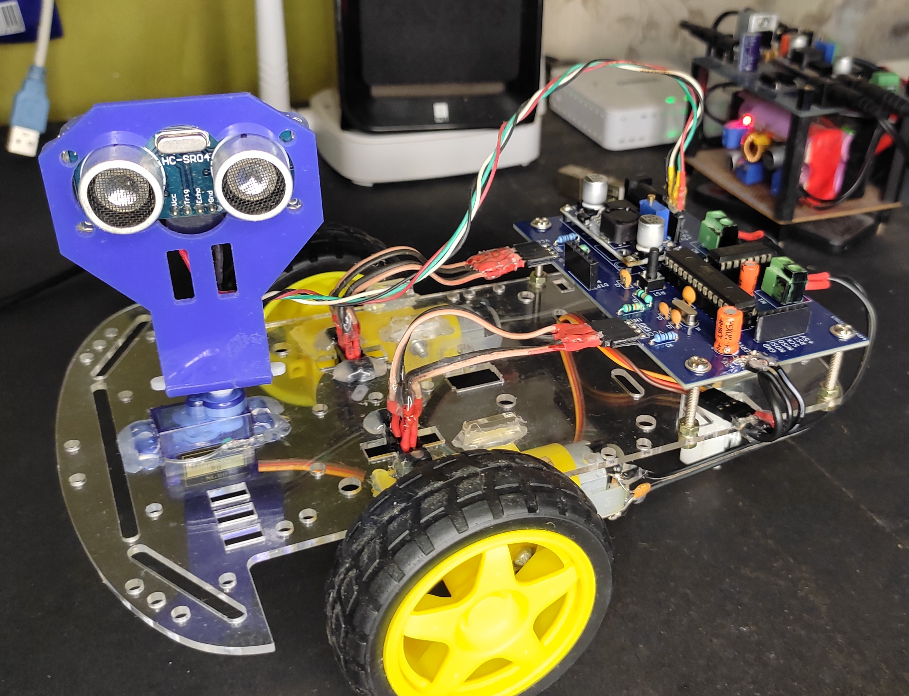

# SDC

ATmega 8 based self driving car.

Watch the [YouTube](https://studio.youtube.com/video/CVWcEM45d_U/edit) video to develop some comprehension.

# SETTING UP ATMEGA 8
The ATmega 8 is programmed using an ICSP programmer. In my case, I used an Arduino UNO as an ICSP programmer.
By default, the microcontroller uses the internal 8MHz internal PC oscillator, but we want to use an external 16 MHz oscillator.
So we need to make certain changes to the fuse bits of the ATmega 8.
